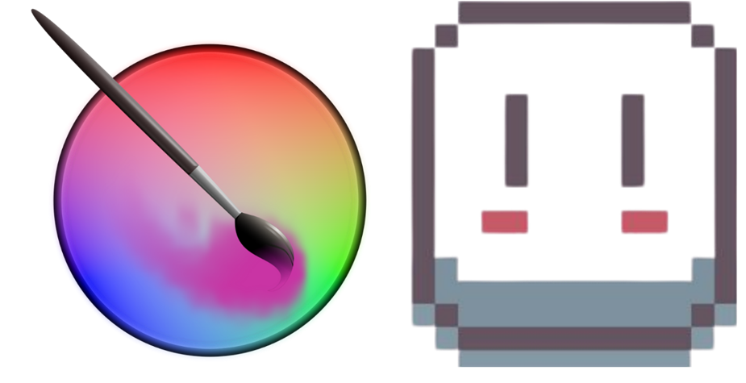

<h1 align="center">🌸✨ Daniela Pozo ✨🌸</h1>

<ul>
  <li>Carrera: Ingeniería en Sistemas de Información</li>
  <li>Hobbie: Dar vida a lo invisible</li>
  <li>Especialidad: Pintar con lógica en un lienzo imposible.</li>
  <li>Con <strong>negrita</strong> y <em>cursiva</em></li>
</ul>

### 💻 Lenguajes de Programación

---

### 🧰 Herramientas

---

### 🎨 Diseño

---

<table>
  <tr>
    <th align="left" width="58%">🛠️ Herramientas</th>
    <th align="left" width="42%">🎨 Diseño</th>
  </tr>
  <tr>
    <td>
      

    </td>
    <td>
      

    </td>
  </tr>
</table>
